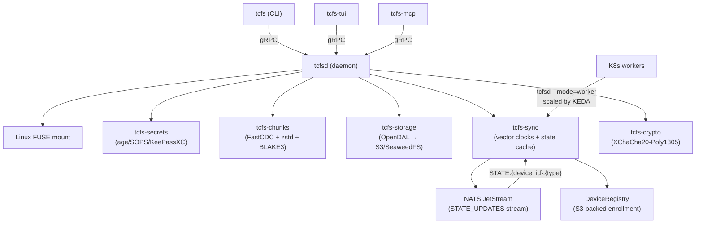

# tcfs — TummyCrypt Filesystem

**FOSS self-hosted odrive-style encrypted sync target**

tcfs is a self-hosted encrypted file sync system backed by [SeaweedFS](https://github.com/seaweedfs/seaweedfs) with core file-content XChaCha20-Poly1305 encryption, SOPS/age-managed credentials, content-defined chunking, Linux FUSE clean-name on-demand hydration, physical `.tc`/`.tcf` stubs for offline/dehydrated paths, and multi-machine fleet sync with vector clocks. Linux is the best-supported runtime today; Apple desktop and mobile surfaces exist but are still experimental.

## Installation

### Binary Releases

`Jesssullivan/tummycrypt` is the canonical source repository. Downstream org
forks may exist for distribution, but releases and source references should
default here.

Download the latest release from [GitHub Releases](https://github.com/Jesssullivan/tummycrypt/releases):

```bash
# macOS (Homebrew, current manual tap flow)
brew tap --custom-remote Jesssullivan/tummycrypt https://github.com/Jesssullivan/tummycrypt.git
git -C "$(brew --repo Jesssullivan/tummycrypt)" fetch origin homebrew-tap
git -C "$(brew --repo Jesssullivan/tummycrypt)" checkout homebrew-tap
brew install Jesssullivan/tummycrypt/tcfs

# Ubuntu 24.04+ / Debian 13+
sudo dpkg -i tcfsd-*.deb tcfs-*.deb

# RPM (Fedora 42 x86_64 proven; RHEL/Rocky pending, daemon-only today)
sudo rpm -i tcfsd-*.rpm

# Nix tagged profile install
TAG=v0.12.12
nix profile install \
  "github:Jesssullivan/tummycrypt?ref=${TAG}#tcfsd" \
  "github:Jesssullivan/tummycrypt?ref=${TAG}#tcfs-cli"

# Linux/macOS tarball convenience installer
# Fast CLI install, but not part of the canonical release-proof surface.
curl -fsSL https://github.com/Jesssullivan/tummycrypt/releases/latest/download/install.sh | sh
```

### Container (K8s worker mode)

```bash
podman pull --arch amd64 ghcr.io/jesssullivan/tcfsd:v0.12.12
```

### From Source

```bash
# Requires the pinned Rust 1.93.0 toolchain (see rust-toolchain.toml), protoc, libfuse3-dev
git clone https://github.com/Jesssullivan/tummycrypt.git
cd tummycrypt
cargo build --release
# Binaries: target/release/tcfs, target/release/tcfsd, target/release/tcfs-tui, target/release/tcfs-mcp
```

### Nix

```bash
nix build github:Jesssullivan/tummycrypt
# Or enter a devShell:
nix develop github:Jesssullivan/tummycrypt
```

## How It Works

1. **Push**: Files are split into content-defined chunks (FastCDC), compressed (zstd), encrypted client-side with XChaCha20-Poly1305, and uploaded to SeaweedFS via S3. Vector clock is ticked and SyncManifest v2 (JSON) is written.
2. **Pull**: Manifests describe the chunk layout. Chunks are fetched, verified (BLAKE3), decrypted, decompressed, and reassembled. Vector clock is merged with remote.
3. **Mount**: The local filesystem surface presents remote files as local names and hydrates on open. On Linux this is exercised primarily through FUSE. Apple desktop surfaces are still evolving and should be treated as experimental.
4. **Unsync**: Convert hydrated files back to physical `.tc` stubs or platform placeholders, reclaiming disk space while keeping the remote copy.
5. **Fleet Sync**: NATS JetStream distributes `StateEvent` messages across devices. Vector clocks detect conflicts; pluggable resolvers handle them (auto, interactive, or defer).

## Architecture



## Binaries

| Binary | Purpose |
|--------|---------|
| `tcfs` | CLI: push, pull, sync-status, mount, unmount, unsync, device management |
| `tcfsd` | Daemon: gRPC service, Linux FUSE mounts, NATS state sync, Prometheus metrics, systemd notify |
| `tcfs-tui` | Terminal UI: 5-tab dashboard (Dashboard, Config, Mounts, Secrets, Conflicts) |
| `tcfs-mcp` | MCP server: 8 tools for AI agent integration (stdio transport) |

## CLI Commands

| Command | Description |
|---------|-------------|
| `tcfs status` | Show daemon status, device identity, NATS connection |
| `tcfs config show` | Display active configuration |
| `tcfs push <path>` | Upload files with chunking, encryption, vector clock tick |
| `tcfs pull <manifest> [local]` | Download files from a manifest path with conflict detection |
| `tcfs sync-status <path>` | Check sync state of a file |
| `tcfs mount <source> <target>` | Linux FUSE mount with clean-name on-demand hydration |
| `tcfs unmount <path>` | Unmount FUSE directory |
| `tcfs unsync <path>` | Convert clean tracked files/directories back to physical `.tc` stubs |
| `tcfs device enroll` | Generate keypair and register in S3 |
| `tcfs device list` | Show all enrolled devices |
| `tcfs device revoke <name>` | Mark a device as revoked |
| `tcfs device status` | Show this device's identity |

## Documentation

### Design Documents (LaTeX → PDF)

Technical design docs are maintained as LaTeX source and built to PDF by CI:

- [Architecture](ARCHITECTURE.md) ([source](tex/architecture.tex)) — system design, crate map, hydration sequence
- [Protocol](PROTOCOL.md) ([source](tex/protocol.tex)) — wire format, chunk layout, manifest schema, gRPC RPCs
- [Security](SECURITY.md) ([source](tex/security.tex)) — threat model, encryption architecture

Build locally: `task docs:pdf` (outputs to `dist/docs/`)

### Guides (Markdown)

- [Contributing](CONTRIBUTING.md) — development setup, PR workflow
- [Benchmarks](BENCHMARKS.md) — partial benchmark snapshot
- [Changelog](../CHANGELOG.md) — release history

### Ops Runbooks
- [Product Reality and Priority](ops/product-reality-and-priority.md) — current proof surface, honest product posture, and prioritized backlog
- [Distribution Smoke Matrix](ops/distribution-smoke-matrix.md) — canonical post-release install proof across Homebrew, `.pkg`, `.deb`, `.rpm`, container, and Nix
- [Packaged Install To First-Real-Use Acceptance](ops/packaged-install-first-use.md) — the bar after artifact smoke passes and before broader host acceptance
- [Lab Host Acceptance Matrix](ops/lab-host-acceptance-matrix.md) — real-host acceptance lanes across `honey`, `neo`, and `petting-zoo-mini`
- [Neo-Honey Live Acceptance](ops/neo-honey-acceptance.md) — named live fleet sync acceptance lane
- [On-Prem Authority Recovery](ops/onprem-authority-recovery.md) — backend-worker Helm recovery plus the on-prem OpenTofu migration boundary
- [Fleet Deployment Guide](ops/fleet-deployment.md) — legacy Civo-era fleet deployment notes plus operational checks
- [Lazy Hydration Demo Acceptance](ops/lazy-hydration-demo.md) — terminal and Finder proof target for lazy `ls`/`cat`/dehydrate flows
- [Lazy Desktop-to-Honey Evidence](release/lazy-desktop-honey-evidence-2026-04-30.md) — live proof of Desktop-originated remote traversal and `cat` hydration on honey
- [macOS FileProvider Local Evidence](release/macos-fileprovider-local-evidence-2026-04-30.md) — local CloudStorage enumeration and exact-content hydration proof
- [macOS Hosted Smoke Backend Bootstrap](release/macos-hosted-smoke-backend-bootstrap-2026-04-30.md) — GitHub environment secret and public S3 backend bootstrap for hosted FileProvider smoke
- [odrive Parity and Product Horizon](ops/odrive-parity-product-horizon.md) — behavioral parity target, Desktop demo boundaries, and productionization backlog
- [Apple Surface Status](ops/apple-surface-status.md) — current reality for macOS and iOS claims
- [macOS Finder and FileProvider Reality](ops/macos-fileprovider-reality.md) — current macOS desktop workflow, proof gaps, and manual acceptance lane
- [macOS FileProvider Testing-Mode Strategy](ops/macos-fileprovider-testing-mode-strategy.md) — Apple profile-type constraints, registered-Mac CI plan, and testing-mode proof gates
- [iOS Surface Status](ops/ios-surface-status.md) — current iOS scope, proof bar, and maintenance expectation

### RFCs

- [RFC 0001: Fleet Sync Integration](rfc/0001-fleet-sync-integration.md) — multi-machine sync design and rollout plan
- [RFC 0002: Darwin FUSE Strategy](rfc/0002-darwin-fuse-strategy.md) — FileProvider as primary macOS/iOS path
- [RFC 0003: iOS File Provider](rfc/0003-ios-file-provider.md) — UniFFI bridge and experimental iOS scaffold architecture
- [RFC 0004: FUSE-Free Architecture](rfc/0004-fuse-free-architecture.md) — draft target architecture for FUSE-free/client-integrated paths

## Platform Support

| Platform | Status | Notes |
|----------|--------|-------|
| Linux x86_64 | Proven primary lane | Host-proven FUSE lifecycle plus CLI/daemon surfaces; packaged first-use/systemd remains a separate gate |
| Linux aarch64 | Available | Release tarball and `.deb`; FUSE is not built in the current cross-compiled release artifact |
| macOS (Apple Silicon) | Experimental | CLI and daemon build, release `.pkg`, and FileProvider packaging exist, but user-facing acceptance coverage is still limited |
| macOS (Intel) | Experimental | CLI binaries ship, but the desktop integration story is not yet as proven as Linux |
| Windows x86_64 | Planned / skeleton | Cloud Files API skeleton; no release-grade CLI, daemon, or Explorer flow |
| iOS | Proof-of-concept | FileProvider direction with unproven write hooks; CI type-checks Swift, but there is no continuously proven device/TestFlight/App Store lane |
| Nix package/profile | Available / Darwin evidence current | Flake package/profile install is proven on Darwin for `v0.12.12`; Linux Nix install proof and NixOS module host proof are separate |
| NixOS module | Available / host evidence pending | NixOS and Home Manager modules exist, but current evidence is not a NixOS host acceptance run |

## License

Dual-licensed under MIT and Apache 2.0.
