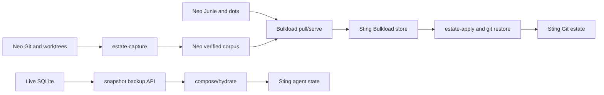

# Requirements

### Completion objective
Complete the Neo → Sting estate with the already-declared **Bulkload paradigm**. Completion is not a partial file landing, a count comparison, or a Rust implementation claim: PR #592 must provide the proven native mover, and it must carry the whole required estate while Sting remains usable.

`bulkload` is the product-contract and historical-rulings SSOT, not a second implementation: `docs/design.md` assigns implementation to tummycrypt PR #592, retires Python, requires live union, and requires real-corpus comparison against rclone. The implementation branch/worktree is `tummycrypt.worktrees/tcfs-bulkload-m1-20260902` on `feat/tcfs-bulkload-m1-20260902`.

### Non-negotiable transport rule
The only approved cross-host ordinary-file or corpus transport is native `tcfs-bulkload-agent` framed transfer through `pull`/`serve` (or its local `copy` equivalent for a same-host controlled test). `rsync`, `scp`, rclone, tar pipes, and manual file copying are forbidden for migration payloads and must never produce completion receipts or benchmark inputs.

The 2.2 GiB `nonblahaj-corpus` copied to Sting by `rsync` is **unattested and excluded**. Quarantine/remove only that destination-side raw-transfer copy after retaining its failure record; do not apply it. Re-transfer a fresh, content-addressed corpus to a separate Bulkload-owned destination with `pull`, persistent source/destination state, and transfer statistics. The original Neo capture remains usable only after its capture receipt and input identity are revalidated.

### Required estate coverage
- Git: all inventory classes—absent workspaces, same-HEAD missing indexes, divergent refs/heads, dirty/index payloads, stashes, common Git administration, linked worktrees, and 22 malformed classes—end as applied or as a durable, typed `BulkloadRefusal`; nothing is silently excluded.
- Worktrees: preserve untracked/dirt/staging and rewrite `.git`, `gitdir`, and `commondir` references from `/Users/jess` to `/srv/fast-local/jess` without overwriting occupied Sting workspaces.
- Agent state: native-delta migrate Neo `~/.junie` (currently 1.6 GiB versus 40 MiB on Sting), preserving sessions, history, skills, MCP/configuration, modes, and Sting-only files. Reconcile Claude and Codex ordinary-file trees only as a native delta; their existing Sting state trees are not overwritten.
- SQLite: transfer snapshots—not live database/WAL/SHM files—then compose Atuin and Codex state with the existing path remap and conflict receipts. `apply-state-candidate` remains the only installation operation for a live database.
- Credentials, platform stores, machine keys, and Home Manager links follow the existing private custody/transcode rules; credentials are never printed. Secret rotation is out of scope (R22).

### Performance and correctness acceptance gates
- **R23 release gate:** On current landed PR #592 code, native Bulkload beats raw rclone on the identical representative real corpus and a 1% delta, with three alternating repetitions, equivalent verification outside timed transfer, and recorded wall time/throughput/RSS. A first-copy loss is a blocking performance defect, not an acceptable final result.
- **R25 resume gate:** interrupted and warm reruns report `source_bytes_read=0` and zero content transfer for unchanged completed content; directory/file revisit counts are reported, with journal gaps or freshness changes correctly invalidating reuse.
- **Safety gates:** live hosts stay live; SQLite uses `sqlite3_backup_*`; typed refusals are fail-closed; native HEAD/index/working bytes on occupied targets are retained.
- **Closure gate:** inventory state `bounded_discovery_complete_registered_worktree_closure_pending` becomes a durable closure report in the existing PR/Linear evidence, enumerating every item, outcome/refusal, digest, and retry status.

### Explicit exclusions
No new mover topology, daemon mount on Sting, revived stillness/quiescence ceremony, new Linear issues, or separate `tcfs-bulkload` driver crate. TIN-3692/reclaim ceremonies are historical context, not substitutes for Bulkload completion.

# Technical Design

### Existing declared architecture
The landed shape in draft PR #592 is authoritative:

- `crates/tcfs-bulkload-agent/src/main.rs` exposes the control plane. Its `pull_command` invokes `ssh -T -oBatchMode=yes … tcfs-bulkload-agent serve`, then calls `transfer::receive` with independent source and destination state paths; `report_transfer` records completed/reused counts, received bytes, source bytes read, and typed refusals.
- `transfer.rs`, `transfer_store.rs`, `hash.rs`, `walk.rs`, and `freshness.rs` implement FastCDC/BLAKE3 transfer with the `(authority, dev, ino, size, mtime_ns, ctime_ns)` reuse identity.
- `estate.rs` owns explicit, lock-protected `estate-add-batch`, `estate-capture`, `estate-apply`, and durable per-item receipts. Existing Sting journals below `/srv/fast-local/jess/state/git-carry/neo/` must be resumed rather than recaptured when their input identity remains valid.
- `git_carry.rs` and `git_carry/{raw_tree,batch_objects,registered,shared,shallow}.rs` preserve Git objects, raw dirt, registered payloads, shared common directories, and shallow-frontier custody.
- `provider_sqlite.rs` provides online backup, composition, hydration, and candidate apply. `tcfs-bulkload-bench/src/main.rs` is the existing native-versus-rclone harness.

The committed branch is at `c6cead96` (`persist bulkload chunks in durable packs`). The current worktree has three uncommitted follow-ups in `transfer.rs`, `transfer_store.rs`, and `tcfs-bulkload-bench/src/main.rs`: serialize the append-only pack writer, deduplicate repeated digests within a persistence batch, and expose precise fixture refusals. All 48 agent tests plus the two `tests/dep_graph.rs` tests pass, and a sealed real-corpus native initial/resume/1%-delta cycle now completes without refusal. Land these changes as one reproducible revision before further profiling or cross-host execution.

### Execution flow

### Implementation decisions and changes
### ✓ Step 1: Invalidate the raw-transfer path
Record the failed `rsync` attempt as a noncompliant incident receipt; quarantine its destination corpus so `estate-apply` cannot select it. Add/verify operator-facing runbook wording in the PR documentation that estate corpus movement uses `pull`/`serve` only, including its required state paths and emitted stats.

### ✓ Step 2: Make PR #592 buildable on both sides from one revision
Integrate the complete shallow custody patch, including `batch_objects` and every referenced Git-carry module. Build identified agent binaries from the committed revision on Neo and Sting; record revision and binary digest alongside every receipt.

### * Step 3: Repair the blocking first-copy performance path
First land the proven single-writer/in-batch-dedup patch and benchmark diagnostics, preserving the successful 48-test result and real-corpus correctness cycle. The latest evidence is a hard failed gate: native initial copy is `32.369s` versus raw rclone `4.112s`; warm retry is zero-read/zero-transfer and the controlled 1% delta reads/transfers only 26 bytes.

Profile the initial phase by separating walk/hash/CDC time, pack append time, SQLite index transaction time, destination materialization, and durability sync time. Replace the current globally serialized capture hot path with a design that keeps one ordered pack publisher but permits bounded parallel file hashing/chunk preparation, publishes chunk locations and manifests in batched SQLite transactions, and performs durability barriers at transaction/checkpoint boundaries rather than per chunk. A manifest/completion record may become visible only after its referenced pack range is durable. Re-run alternating native/rclone/native/rclone/native trials on the same sealed corpus after each material change; R23 passes only when native wins median initial and delta wall time with equivalent out-of-band verification, RSS under 2 GiB, and unchanged R25 zero-reread behavior. No estate transport or apply begins before this gate passes.

###   Step 4: Transport every capture natively
For each reviewed plan, capture to a Neo private corpus, invoke Sting-side `pull` against Neo `serve` with isolated durable source/destination stores, verify transfer receipt/digests, then use that Bulkload-owned corpus as the sole input to `estate-apply`. Interrupted transfers resume through the same stores; no raw fallback is permitted.

###   Step 5: Classify before force
Re-run the inventory and group only compatible items into explicit plans. Apply absent destinations; use `git-repair-missing-index` for same-HEAD index gaps; use attach/registered-payload verbs for payload-only restoration; retain occupied/ignore-policy conflicts as typed refusals. The shallow patch must turn shallow frontiers into `shallow-frontier-v1` custody rather than `GIT_INVENTORY_MALFORMED` failures. A registered linked worktree of the same repository nested inside a checkout (Claude Code's `<repo>/.claude/worktrees/<name>` convention; the `lab` refusal at `git_carry.rs` `filesystem_rows`) is `nested-worktrees-v1` custody: its subtree is not walked or carried by the enclosing item, the capture manifest names its relative path, worktree name and HEAD, and the worktree is captured as its own plan item. Any other nested `.git` (an independent repository, a pointer to a foreign repository, a symlink) still refuses `GIT_INVENTORY_MALFORMED`. Capture omits a fixed rebuildable set (`target`, `node_modules`, `.venv`, `venv`, `__pycache__`, `.direnv`, `.pytest_cache`, `.mypy_cache`, `.ruff_cache`, `.gradle`, `.next`, `.turbo`, `.parcel-cache`, `.swc`, `.terraform`) wherever it is a real directory at any depth with nothing tracked beneath it, and names each omitted root and its measured size in `rebuildable-omissions-v1` custody; every other untracked and ignored file is still carried. `--include-rebuildable` opts an item back in to full fidelity and reproduces the pre-omission capture key. Other malformed sources (gitlinks, intent-to-add, nested Git, missing source) need either a supported capture result or an explicit retained-custody refusal.

###   Step 6: Treat agent state by type
Native-pull Junie and ordinary configuration/session trees to dedicated agent-state stores with mode preservation and non-clobbering union. Snapshot live SQLite, transfer the snapshot natively if cross-host movement is required, compose paths/rows offline, hydrate rollouts, validate the candidate, and only then apply it under explicit authorization.

### Artifact locations and receipts
- Code: the existing M1 worktree files above, landed into PR #592; no new crate.
- Git plan/capture/apply journals: `/srv/fast-local/jess/state/git-carry/neo/` and a distinct new Bulkload-owned location for the replacement of `estate-absent-20260918/nonblahaj-corpus`.
- Benchmark evidence: the existing `.bulkload-bench-real-ee15653` evidence area plus a committed PR-facing result table describing corpus identity, command revision, rclone arguments, repetitions, raw measurements, and verdict.
- Closure evidence: the existing Linear issues and PR #592 only, per R43; durable technical receipts remain under state roots and relevant repository documentation, never temporary directories.

### Risks and controls
- **Initial transfer still loses to rclone:** the current measured gap is about 7.9× (`32.369s` vs `4.112s`), so tuning constants alone is unlikely to suffice. Instrument phase costs, retain bounded parallel preparation, batch pack/index publication and sync barriers, and block migration-complete status rather than weakening R23.
- **Raw corpus contamination:** use a fresh destination store and explicit receipt lineage; the rsync destination cannot be reused.
- **Live mutation:** let freshness/capture-key changes refuse/retry; never publish a torn bundle.
- **Sting-only worktrees / occupied destinations:** preserve destination HEAD/index/payload and keep a refusal for human resolution.
- **SQLite writers:** use online backup retries; never copy `-wal`/`-shm`.
- **Shallow and malformed Git:** preserve the local shallow frontier and exact failure class rather than inventing unreachable parent history.

# Testing

### Validation matrix
- Run `cargo test -p tcfs-bulkload-agent --locked`, `tests/dep_graph.rs`, formatting, and clippy on the committed PR revision; specifically retain the shallow graph round-trip, symlink canonicalization, raw-tree, registered payload, freshness, and transfer resume tests.
- Add/regress tests for the first-copy pipeline: duplicate chunks within and across batches are stored once but materialized in manifest order; concurrent preparation cannot race pack offsets; manifests remain invisible until referenced pack bytes are durable; interruption at each pack/index/manifest boundary resumes correctly; completed chunks are never reread.
- Run the existing benchmark as alternating `native/rclone/native/rclone/native` against the same sealed real corpus and controlled 1% delta. Capture corpus identity, committed binary digest, per-phase walk/hash/pack/SQLite/materialize/sync timing, wall time, throughput, `source_bytes_read`, `bytes_received`, stat/revisit counts, RSS, verification result, and rclone version/configuration. Native must win median initial and delta time; warm retry must remain zero-read/zero-transfer.
- Perform a native `pull` interruption/resume of an estate-sized corpus from Neo to Sting. Assert the final corpus has the expected manifest/digest and the warm retry reports zero unchanged source bytes; verify no raw-tool entry exists in the receipt lineage.
- Re-census the estate after every plan set. Check Git common-dir/head/ref/index semantics, stashes, untracked payload digests, modes, worktree pointers, shallow metadata, and no changes to occupied Sting workspaces.
- For Junie, compare session/history/skill inventory and permission modes while retaining Sting-only files. For Atuin/Codex, validate candidate database integrity, row union/conflict receipts, path remaps, and hydrated rollout availability before authorized apply.
