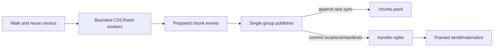

# Requirements

### Objective
Complete the existing Bulkload product and Neo → Sting estate through PR #592 without weakening the declared safety model. The current `32.369s` native versus `4.112s` rclone initial-copy result remains a hard R23 failure; estate transport/apply stays blocked until native wins the corrected gate.

### In Scope
- Replace the correctness-only `CAPTURE_WORKERS=1` workaround with bounded parallel CDC/hash preparation and one durable publisher over the existing `chunks.pack`.
- Preserve `synchronous=FULL`, content-addressed deduplication, manifest order, freshness invalidation, typed refusals, bounded memory, and R25 zero-reread resume.
- Correct the benchmark contract so the delta deterministically mutates approximately 1% of regular-file corpus bytes while leaving the sealed input untouched.
- After R23/R25 pass, execute native-only estate transport, classify/apply Git and worktree items, compose agent/provider state, and publish closure evidence in the existing PR/Linear surfaces.

### Acceptance Gates
- **R23:** three alternating native/rclone/native/rclone/native samples on the same identified fixture; equivalent full-BLAKE3 verification remains outside timing. Native median wall time must beat rclone for initial copy and the 1%-of-bytes delta, with native peak RSS below 2 GiB.
- **R25:** unchanged warm and interrupted resumes report `source_bytes_read=0` and `bytes_received=0`; freshness or journal gaps invalidate reuse.
- **Durability:** no chunk location references unsynced pack bytes; no capture manifest becomes visible before all referenced chunk batches are durable. Interrupted publication safely truncates unindexed pack tails or refuses indexed corruption.
- **Migration:** every reviewed estate item ends as applied or a durable typed refusal; no rsync/rclone/scp/tar payload enters receipt lineage, occupied Sting state is not overwritten, and live SQLite moves only through snapshot/compose/candidate-apply flows.

### Exclusions
No new mover topology, crate, async runtime, object-store dependency, issue, live-database file copy, or relaxation of `PRAGMA synchronous=FULL`. The quarantined raw-transfer corpus remains ineligible.

# Technical Design

### Current Findings
- `crates/tcfs-bulkload-agent/src/transfer.rs` currently opens one `Store` per capture worker. The uncommitted safety patch reduces `CAPTURE_WORKERS` from four to one because all stores append the same pack.
- `Store::put_chunks` in `transfer_store.rs` holds `BEGIN IMMEDIATE` across digest checks, pack append, and `sync_all`; concurrent stores can derive conflicting offsets from pack length. The same API is used by destination `receive_chunks`, so transaction shortening benefits both transfer halves.
- The uncommitted patch correctly deduplicates repeated digests within a batch and improves fixture-refusal diagnostics, but it is a correctness baseline rather than the performance solution.
- `tcfs-bulkload-bench/src/main.rs` already alternates arms and verifies outside timing. Its current delta adds tiny files equal to 1% of file count, and its RSS value is a process/children peak rather than a resettable per-arm sample; evidence labels must not overclaim either metric.

### Selected Architecture
Keep the existing single `chunks.pack` format. Parallel file workers emit bounded, ordered chunk-batch events through a backpressured channel; one publisher owns the pack descriptor and writable SQLite connection.



### Publication Contract
Introduce internal contracts equivalent to:

```rust
PreparedEvent::Chunks { capture_id, chunks }
PreparedEvent::Complete { capture_id, key, manifest }
PreparedEvent::Refused { capture_id, refusal }

StorePublisher::publish_group(events: &[PreparedEvent]) -> Result<PublishAcks>
```

- Workers retain manifest chunk order and emit at most `PERSIST_BATCH` payloads per event; channel capacity and worker count impose a documented memory ceiling.
- The publisher validates/deduplicates a group before opening a transaction, resolves already-stored digests, appends missing payloads from one known end offset, and syncs the pack once per bounded group.
- Only after pack sync does it open a short `BEGIN IMMEDIATE`, insert chunk locations, insert completed capture manifests whose preceding batches are acknowledged, and commit under `synchronous=FULL`.
- A failed freshness recheck publishes no manifest. Already-durable content-addressed chunks may remain reusable.
- Acquire a nonblocking writer lock using the existing `libc::flock` guard pattern from `estate.rs`; readers may continue through separate connections.
- On publisher startup, compare pack length with the maximum committed `offset + size`. Truncate and sync an unindexed tail; fail closed if an indexed range exceeds the pack or overlaps inconsistently.
- Expand timing counters around walk/reuse census, CDC/hash, queue wait, pack append/sync, SQLite commit, transfer, and destination materialization. Keep cumulative/process-scope labels explicit.

### Benchmark Contract
In `tcfs-bulkload-bench/src/main.rs`, replace tiny-file delta creation with deterministic in-place mutations totaling approximately 1% of regular-file bytes in the private fixture. Record files/bytes changed, before/after corpus identities, exact revision and rclone command/version, raw repetitions, phase timing, transfer/read counters, sync counts, RSS scope, verification, and computed medians/verdict.

### Estate Completion
Once R23/R25 pass, continue the existing architecture: `main.rs` `pull/serve` and `transfer::receive` for all transport; `estate.rs` plus `git_carry/*` for reviewed Git/worktree outcomes; `provider_sqlite.rs` and `provider_sqlite/{online,hydrate}.rs` for snapshot, composition, hydration, and candidate apply. Resume existing `/srv/fast-local/jess/state/git-carry/neo/` journals and update `docs/ops/neo-sting-bulkload-estate-runbook.md`; do not create a parallel workflow.

### Research Basis
The design follows SQLite’s official WAL durability ordering and commit-sync guidance rather than switching to `synchronous=NORMAL`; restic’s documented immutable pack plus reconstructable-index model supports treating pack bytes as durable before index visibility. CDC literature (Gregoriadis et al., arXiv:2409.06066) also supports measuring chunking throughput and deduplication behavior independently, which is why phase-level evidence is required.

# Testing

### Automated Validation
- Extend `transfer.rs`/`transfer_store.rs` tests for repeated digests within/across groups, files larger than `PERSIST_BATCH`, manifest order, bounded queue behavior, concurrent preparation, and zero-reread resume.
- Add deterministic fault injection around append, pack sync, location insert, manifest insert, and SQLite commit. Reopen the store after each interruption and verify tail reconciliation, no visible torn manifest, and correct retry.
- Retain `cargo test -p tcfs-bulkload-agent --locked`, `tests/dep_graph.rs`, formatting, and clippy; the R34 dependency wall and deny-panic rules remain unchanged.

### SLO Evidence
- Run the corrected real-corpus benchmark with three alternating repetitions and archive raw rows plus the median verdict. Reject runs with changed source identity, refusals, incomplete verification, unknown revision/rclone identity, or reused work roots.
- Verify initial and 1%-byte delta wins, native RSS below 2 GiB, unchanged warm zero-read/zero-transfer, and interruption resume with identical final payload.

### Product and Migration Validation
- Run an estate-sized Neo → Sting `pull/serve` interruption/resume before any apply and verify receipt lineage contains only native Bulkload transport.
- Re-census Git/worktree semantics, untracked/index data, modes, pointers, shallow custody, and occupied-target refusals after each reviewed plan.
- Validate Junie/session/skill/config union and Sting-only retention. For Atuin/Codex, run integrity checks against composed candidates and apply only through `apply-state-candidate`.
- Produce a closure report enumerating every discovered item, digest, outcome/refusal, and retry status; completion requires no silent remainder.

# Delivery Steps

### ✓ Step 1: Build the bounded single-publisher transfer pipeline
Source capture and destination ingestion publish durable chunk groups without concurrent pack-offset races.

- Refactor `crates/tcfs-bulkload-agent/src/transfer.rs` to restore bounded parallel CDC/hash work and send ordered chunk/completion events through a backpressured channel.
- Refactor `transfer_store.rs` so one publisher owns pack appends and the writable SQLite connection; validate/deduplicate outside short index/manifest transactions.
- Add writer locking, unindexed-tail reconciliation, explicit memory bounds, and phase timing without adding dependencies or changing the framed transport topology.
- Add concurrency, duplicate-content, large-file, and injected-crash tests as part of the implementation.

### * Step 2: Make the real-corpus gate reproducible and enforceable
The benchmark emits an auditable R23/R25 verdict for initial, warm, interrupted, and 1%-of-bytes delta workloads.

- Update `crates/tcfs-bulkload-bench/src/main.rs` to mutate approximately 1% of fixture bytes deterministically and record pre/post identities and exact mutation size.
- Report raw alternating samples, medians, throughput, read/received bytes, phase/sync timings, accurately scoped RSS, revision, and rclone identity/configuration.
- Run crate tests, dependency-wall tests, fmt/clippy, fault recovery, and the real-corpus matrix; retain R23 as failed until native wins both required medians while R25 remains zero-read/zero-transfer.
- Update the existing operator runbook and PR-facing evidence table with commands, raw results, and verdict.

###   Step 3: Transport and classify the complete estate natively
Every reviewed Neo capture reaches a fresh Bulkload-owned Sting store through `pull/serve` and is classified for safe application.

- Revalidate capture identities and resume existing journals under `/srv/fast-local/jess/state/git-carry/neo/`.
- Perform estate-sized native transfer with persistent source/destination state, interruption/resume proof, binary revision/digest, and receipt lineage checks.
- Re-census and group absent, same-HEAD index, divergent, dirty, stash, shared/worktree, shallow, and malformed Git classes into compatible plans.
- Quarantine the prior raw-transfer destination and retain typed refusals for unsupported or occupied targets.

###   Step 4: Apply Git and worktree outcomes without clobbering Sting
Reviewed Git repositories and linked worktrees are restored or closed with durable typed refusals.

- Use `estate.rs` and `git_carry/{raw_tree,batch_objects,registered,shared,shallow}.rs` for the applicable outcome of each classified item.
- Preserve target HEAD/index/working bytes, untracked/staged content, stashes, common directories, modes, and rewritten worktree pointers.
- Validate each applied batch against source receipts and rerun the census so no item disappears between discovery and closure.
- Record retryable and terminal refusals in the existing journals and PR/Linear evidence.

###   Step 5: Compose provider state and close the migration
Agent configuration and provider databases are safely unioned, validated, applied, and represented in a complete closure report.

- Native-delta transfer Junie and ordinary Claude/Codex trees while preserving Sting-only files, modes, sessions, history, skills, and MCP configuration.
- Use `provider_sqlite.rs` and its `online`/`hydrate` modules for live snapshots, offline composition, path remaps, conflict receipts, integrity checks, and authorized candidate apply.
- Verify service usability and warm native retry after application.
- Publish the durable registered-worktree closure report with every item, digest, outcome/refusal, and retry status in the existing PR/Linear surfaces.
